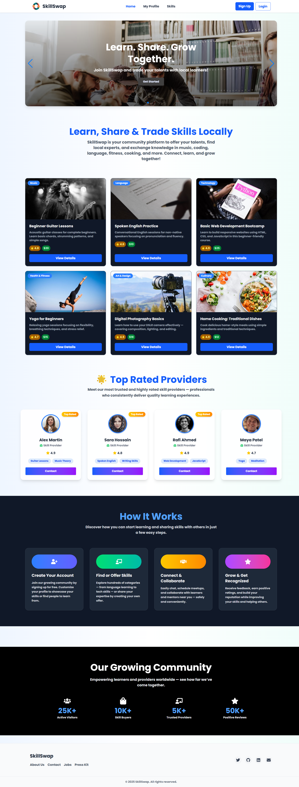
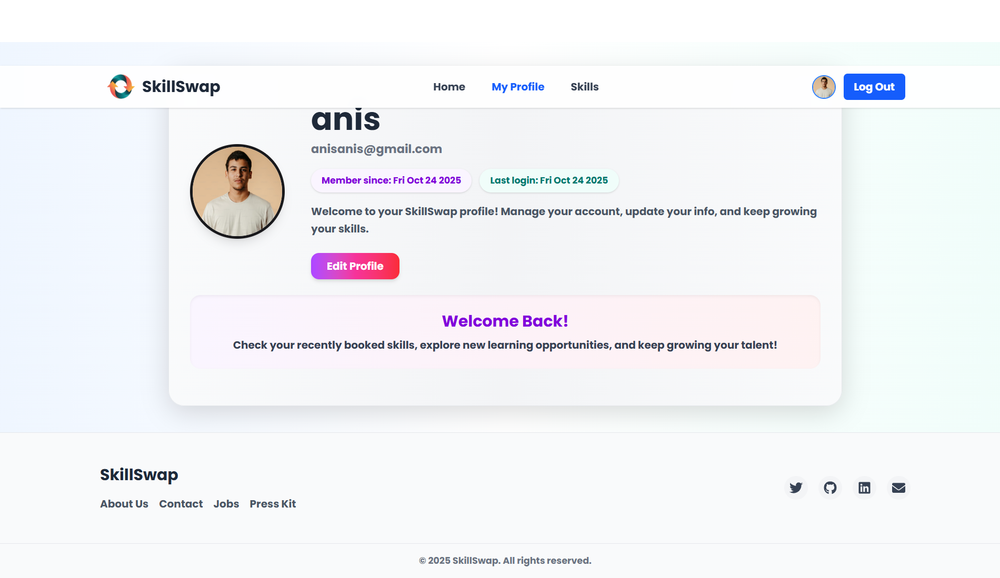

# SkillSwap – A Local Skill Exchange Platform

## Project Theme

**SkillSwap** is an interactive platform for individuals to offer, learn, and trade skills within their local area. Whether it’s guitar lessons, language exchange, coding help, or yoga training — users can browse listings, rate experiences, and connect with local skill providers.

This platform aims to **foster community learning, skill-sharing, and local networking** in a seamless and user-friendly way.

---

## Features

* **User Authentication**
  Sign up, login, and manage your profile securely with Firebase Authentication.

* **Skill Listings**
  Browse, search, and filter skills offered by local providers.

* **Skill Exchange**
  Connect with providers to learn new skills or offer your own.

* **Ratings & Reviews**
  Users can rate and provide feedback on skill experiences.

* **Profile Management**
  Update your profile info, including photo, bio, and skills.

* **Responsive Design**
  Minimalist and modern interface optimized for both desktop and mobile devices.

* **Social Connections**
  Contact skill providers via email or social links.

* **Carousel / Slider**
  Highlight top-rated providers and skills using **Swiper.js**.

---

## Tech Stack

* **Frontend:** React.js, Tailwind CSS
* **Routing:** React Router DOM
* **State Management:** React Context API
* **Authentication & Backend:** Firebase Authentication & Firestore
* **Notifications:** react-hot-toast
* **Icons:** react-icons (FontAwesome icons)
* **Carousel/Slider:** Swiper.js

---

## Packages Used

```bash
npm install react react-dom react-router react-router-dom
npm install firebase
npm install react-hot-toast
npm install react-icons
npm install tailwindcss postcss autoprefixer
npm install @tailwindcss/line-clamp
npm install swiper
```

* **react-router-dom:** Client-side routing
* **firebase:** Authentication and database
* **react-hot-toast:** Notification system
* **react-icons:** Icon library for UI elements
* **tailwindcss:** Utility-first CSS framework for styling
* **@tailwindcss/line-clamp:** Truncate long text elegantly
* **swiper:** Carousel/slider for showcasing top-rated skills and providers

---

## Screenshots

**Home Page**


**Profile Page**


**Register Page**


## Live Demo

You can try the live demo of SkillSwap here:
**[Live Demo Link](https://skill-swap-web.netlify.app/auth/login)**

---


## License

This project is licensed under the MIT License.

---

## Contact

You can reach out to the developer:

* **Email:** [abedpersonal2024@gmail.com](mailto:abedpersonal2024@gmail.com)
* **Twitter:** [https://x.com/AbedazimReal](https://x.com/AbedazimReal)
* **GitHub:** [https://github.com/the-abed](https://github.com/the-abed)
* **LinkedIn:** [https://www.linkedin.com/in/mohammad-abed-477100386/](https://www.linkedin.com/in/mohammad-abed-477100386/)

